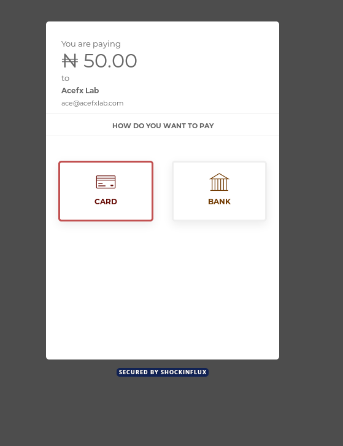

# React library for implementing Shockinflux Payview

A React library for Shockinflux-Payview Payment Gateway.

### Demo


### Install
```bash
npm install react-shockinflux-payview --save
```

### Usage

```javascript
    import React, { Component } from 'react'
    // import the library
	import ShockinfluxPayview from 'react-shockinflux-payview'

    class App extends Component {

    		state = {
    		  key: "g1xq8y87************9XBJbKXuZo+x3uqw=", // RavePay PUBLIC KEY
    		  email: "foo@example.com", // customer email
    		  amount: 10000 // amount, 
    	  }

    	  callback = (response) => {
    		  console.log(response);

    	  }

    	  close = () => {
    		  console.log("Payment canceled");
    	  }

    	render () {
        return (
          <div className='App'>
            <p className='App-intro'>
    	        <ShockinfluxPayview
    		        text="Make Payment"
    		        class="shockinflux-inline-btn"
    		        email={this.state.email}
    		        amount={this.state.amount}
    		        currency={this.state.currency}
    		        template={this.state.template}
    		        language={this.state.language}
    		        action={this.state.action}
    		        transactionid={this.state.transactionid}
    		        storeid={this.state.storeid}
    		        comment={this.state.comment}
    		        callback={this.callback}
    		        close={this.close}
								tag="button"
    	        />
            </p>
          </div>
        )
      }
    }

    export default App
```

## Contributing

1. Fork it!
2. Create your feature branch: `git checkout -b feature-name`
3. Commit your changes: `git commit -am 'Some commit message'`
4. Push to the branch: `git push origin feature-name`
5. Submit a pull request 😋

Don't forget to give me a star and [follow me on twitter](https://twitter.com/temitopedaviid)!

Thanks!
Adesoji Temitope.

## License

This project is licensed under the MIT License - see [LICENSE.md](LICENSE.md)
